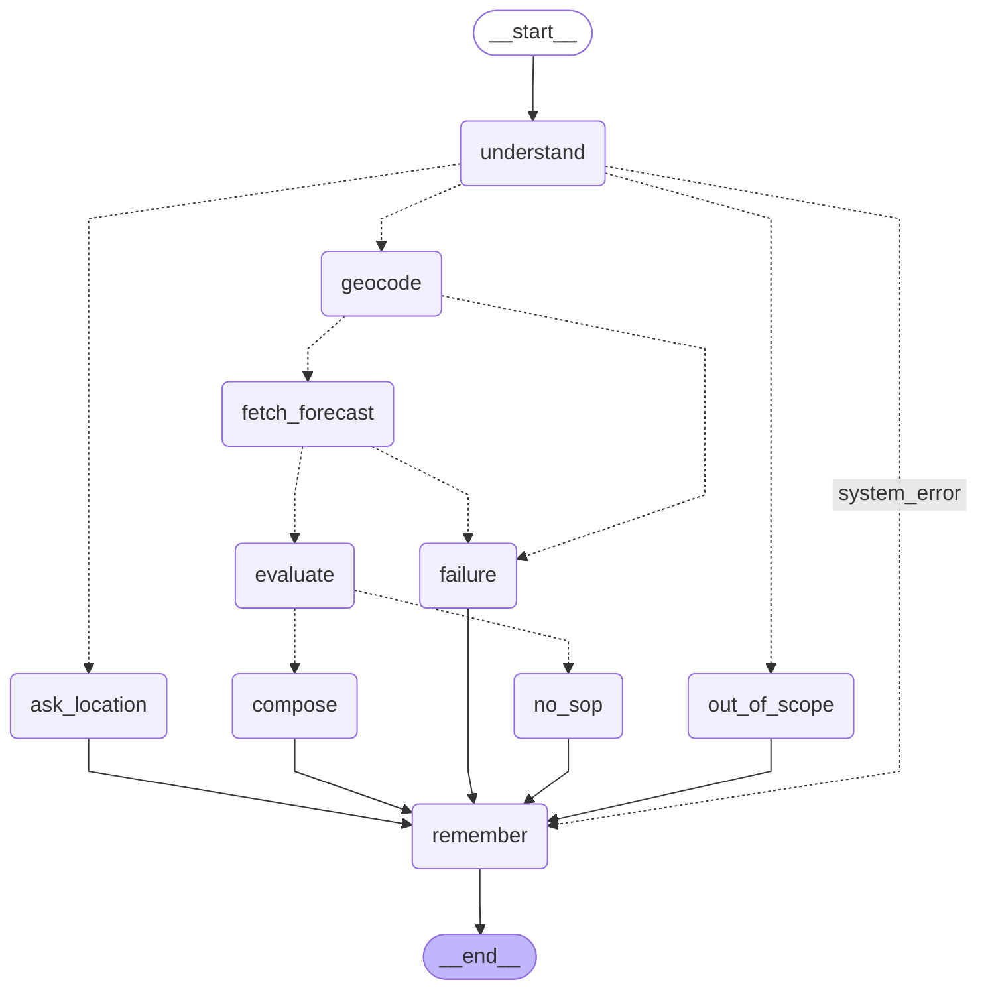

# Weather-Advisory Support Bot

> 🌐 **Live Demo:** [https://weather-advisory.onrender.com](https://weather-advisory.onrender.com/)

A LangGraph chatbot that answers outdoor-activity safety questions ("is it safe to cycle today?", "should I take my
kid to the park?", "good day for a picnic?") from **live Open-Meteo data** and **written SOPs**. The model never decides
what advice is correct. It only (a) understands the question and (b) phrases an answer that code has already decided.

10-minute walkthrough and live-demo script: [docs/REVIEW_GUIDE.md](docs/REVIEW_GUIDE.md) · Plan: [PLAN.md](PLAN.md) · Design rationale and known gaps:
[docs/DECISIONS.md](docs/DECISIONS.md) · Project rules for contributors/agents: [CLAUDE.md](CLAUDE.md)

## Setup and run

Requires Python 3.10+. Backend: the LangGraph agent in `weather_bot/` behind a small FastAPI server (`server.py`). Frontend: a hand-built page in `web/` (plain HTML, CSS and JS, no build step) that the same server serves.

```bash
python -m venv .venv
. .venv/Scripts/activate          # Windows Git Bash; PowerShell: .venv\Scripts\Activate.ps1 ; macOS/Linux: source .venv/bin/activate
pip install -r requirements.txt
cp .env.example .env              # then put your GEMINI_API_KEY in .env (git-ignored; never commit it)
```

| What | Command / Link |
|---|---|
| Live Demo | [https://weather-advisory.onrender.com](https://weather-advisory.onrender.com/) |
| Backend + frontend together (open http://localhost:8000) | `uvicorn server:app --port 8000` |
| Offline tests (no key, no network) | `python -m pytest -q` |
| Validate policies after editing | `python -m weather_bot.sops` |
| Eval suite (needs key + network) | `python -m evals.run_evals` (writes [evals/RESULTS.md](evals/RESULTS.md)) |

Default provider is Google Gemini (`WEATHERBOT_PROVIDER=gemini`, model `gemini-3.5-flash-lite`, free key from aistudio.google.com).
Groq (`openai/gpt-oss-120b`) and Anthropic (`claude-sonnet-5-5`, **not exercised in evals**) are also supported via
`WEATHERBOT_PROVIDER`. Override the model with `WEATHERBOT_MODEL`. Only `weather_bot/llm.py` knows about the provider.

## How it works



*Generated from the compiled graph by `python -m weather_bot.graph` (dotted arrows are conditional routes); a test fails if this diagram ever drifts from the code.*

| Step | Who does it | Why |
|---|---|---|
| Understand the question: location, time window, which SOP *topics* it concerns | **LLM**, structured output, may only pick ids from the SOP catalog it is shown | Paraphrases ("scoot to work on my Activa") must match "two-wheeler" SOPs; keyword lookup can't |
| Geocode + fetch forecast | Code (`weather.py`) | Facts must come from the API; failures go to an honest message |
| Do the SOP conditions hold? | Code (`sops.py`), declarative conditions | The safety verdict is deterministic and auditable |
| Which SOP wins | Code (`sops.rank`) | Decided on purpose, see below |
| Wording | **LLM** (`compose`), given only the winning advice + API facts, never the raw question | Language only |
| Check the wording | Code (`reply.check_prose`) | Any number not from the API/SOP, or any cited id that isn't a matched SOP, discards the model text and uses fixed SOP wording |
| Citation, data and source footer | Code (`reply.footer`), always appended | "Why did it say that?" never depends on the model |

Branching that is real, not decorative: out-of-scope, missing location, geocode failure, forecast failure, no-SOP-applies,
LLM-wording-rejected fallback, and LLM-down fallback are distinct paths (visible in the UI's "How this answer was produced").

## The SOPs: [policies/sops.yaml](policies/sops.yaml)

**Form: a single YAML file with a declarative condition language** (metric, aggregation, time window, operator, threshold,
nested all/any). Chosen because policy owners can read and diff it, it validates at load time (typos, unknown metrics,
bad windows fail loudly), and code never has to change: the weather fields fetched are derived from whatever metrics the
SOPs reference.

16 SOPs, 5 categories, severities 0-4:

| Category | SOPs |
|---|---|
| regional_hazard | HAZ-001 heavy rainfall spell (sev 3) · HAZ-002 very heavy (sev 4, supersedes 001) · HAZ-003 thunderstorm (3) |
| outdoor_exercise | EXR-001 high UV (2) · EXR-002 dangerous heat index (3) · EXR-003 gusts for cyclists/two-wheelers (3) · EXR-004 wet roads (2) |
| travel | TRV-001 likely rain (2) · TRV-002 low visibility (3) · TRV-003 gusts at sea/coast (3) |
| vulnerable_groups | VUL-001 heat/older adults (3) · VUL-002 rain/storm/children (2) · VUL-003 hot pavements/pets (2) |
| leisure (fuzzy) | LEI-001 pleasant (0) · LEI-002 poor (2) · LEI-003 mixed (1) |

**The regional rain-system case.** HAZ-001/002 are `any_outdoor` (a candidate for every outdoor question, whatever the
activity) and `lead` (always presented first). They use the 24-hour **rainfall total** against IMD's published categories
(heavy >= 64.5 mm, very heavy >= 115.6 mm), not any single hourly value, so a system that is only 3 mm/h at every hour
but 72 mm in a day still triggers (covered by test and eval E06b). Honest limit: we infer the system from Open-Meteo's
forecast rainfall, we do not ingest IMD bulletins.

**The fuzzy scenario.** "Is today good for a picnic?" has no single threshold, so matching is semantic (the model maps
"family cookout" to the leisure SOPs by *meaning*) while the verdict is a small rubric: five comfort criteria that must
*all* hold for LEI-001, with LEI-003 as the exact complement (so a daytime window is never left without an answer; this
gap was found by running live data, see DECISIONS.md) and LEI-002 for clearly poor weather.

**When several SOPs apply: decided on purpose.** Superseded SOPs are dropped, then `lead` SOPs come first, then higher
severity, then id. The top one is the primary answer and up to two more are listed as "also applies". Rationale: a user
asking about cycling in a rain system must hear about the rain system first, and hiding a second genuine hazard would be
worse than a slightly longer answer. All matched SOPs are cited in the footer.

## Non-negotiables: where each is enforced

| Requirement | Enforcement |
|---|---|
| Traceable to an SOP or an explicit "no SOP applies" | `reply.footer` / `reply.no_sop_reply` (code, not model); tests `test_graph.py`, evals E01-E08 |
| Add/change a policy without touching code | Policies are YAML; metrics fetched are derived from them; `test_adding_an_sop_needs_no_code_change` appends a new SOP with a new weather metric and passes with no code change |
| Never answer with a forecast it doesn't have | `WeatherError` -> `failure` node -> fixed message with no numbers; tests + evals E09a/b/c |
| Never invent generic advice | No-match path returns fixed text; the LLM is not called at all (tested: `not llm.payloads`); evals E08a/b |
| Numbers come from the API, not the model | Footer numbers are formatted by code from API values; model prose is rejected by `check_prose` if it contains any number not in the facts/SOP text; evals E10c |
| Can't claim a policy that doesn't exist | Unknown ids dropped at `understand`; cited ids in prose must be matched SOPs; eval E10b |
| 11th SOP live | See below |

### Adding an SOP live (the review-call scenario)
1. Append an entry to `policies/sops.yaml` (copy any existing one; `applies_to` is plain English describing the topic).
2. `python -m weather_bot.sops`. Validation names any mistake (unknown metric/window, duplicate id, bad supersedes).
3. The server re-reads the file when it changes on disk; the next question can use it. No restart, no Python touched.

Limits, said plainly: a *new Open-Meteo variable* must be in `weather.ALLOWED_METRICS` (a one-line allowlist that exists so a
typo can't turn every forecast request into an HTTP 400), and a new *aggregation or operator* would need code. A new
threshold, rule, severity, category, time window or any allowlisted metric is YAML only.

## Session memory

LangGraph `MemorySaver`, one thread per chat session (the UI's "New session" or a reload starts fresh; nothing persists
across restarts, as the brief specifies). Carried state: last location, window, activity, SOP topics, and the last three
decisions (policy id, severity, place, window). Follow-ups such as "what about this evening instead?" reuse the city and
the previous activity's SOP topics, and the previous decisions are passed to the writer so answers stay consistent.
Weather is always re-fetched; memory is never a data source. Tested in `test_graph.py` and eval E11.

## The frontend

`web/` is a custom page, not a chat template: answers are laid out as a **bulletin** (severity word, the answer in a serif face,
a ruled ledger of the exact API numbers, policy citations, the source line). The sky behind it changes mood with the severity of
the latest answer (calm teal for favourable, amber for caution, ember for warning, deep red for danger, slate when no policy applies,
grey on a data failure). Progress shown while you wait is the **real** graph: the server streams each node as it finishes
(`POST /api/chat`, newline-delimited JSON). Click any policy id, in the rail or in an answer, to open a drawer showing the policy's
verbatim text and the conditions that trigger it. Server-supplied text is only ever inserted with `textContent`, so a model reply
cannot inject markup. Keyboard: `/` focuses the input, `Esc` closes drawers. Layout adapts to phones; animation is off under
`prefers-reduced-motion`. Fonts (Newsreader, Hanken Grotesk, IBM Plex Mono) load from Google Fonts.

## Evals

`python -m evals.run_evals` runs the **real model** through the real graph (22 cases, E01-E12, see
[evals/run_evals.py](evals/run_evals.py)) and writes [evals/RESULTS.md](evals/RESULTS.md) with, for every case, what it
checks, what a pass looks like, and the result. Coverage: SOP applies (E01, E02) · paraphrase (E03, E04, E05) ·
multi-SOP resolution (E06) · severe live weather grounded in independently recomputed API numbers (E07, E07b, E07c) · the brief's own Bhopal question, live, with a data-driven oracle (E07d) · adding an 11th SOP live with the real model (E12) · no SOP (E08) · API failure (E09) ·
adversarial: instruction override, fabricated policy id, dictated numbers (E10) · session memory (E11).

Weather in each case is labelled **LIVE**, **FIXTURE** (a forecast the suite controls, so SOP outcomes are deterministic
and don't depend on today's sky), **RECORDED**, or **FAILURE** (injected outage). Fixture cases still use the real LLM:
what is under test is the model-facing behaviour (paraphrase, injection, grounding), not the sky.

**Eval results.** Latest run (2026-10-02, model `gemini-3.5-flash-lite`; full table with per-case detail in
[evals/RESULTS.md](evals/RESULTS.md)): **21 passed, 0 failed, 1 skipped** (E07, the live *heavy-rain* case: no scanned city had an
IMD-"heavy" forecast that day, so E07b replays a *synthetic* event instead; the live severe-weather requirement is still met today by E07c, which found real dangerous heat in Kolkata and verified every number against the raw API data).
85 offline tests also pass. Earlier on 2026-10-01 the suite also gave 18 passed / 0 failed / 1 skipped, twice, on Groq
`openai/gpt-oss-120b`. So the result held across two different model families, which is stronger evidence than one model.

Honest notes on how we got there. The first real-model run (Groq) had **6 failures of 19** and all were real defects, not test noise:
(1) Groq's default tool-call mode intermittently rejected valid output (switched to JSON-schema mode + one retry);
(2) the matcher sometimes picked only one of several sibling SOPs (the catalog now groups SOPs by topic and code expands to the whole topic);
(3) the open-ended "nice day for..." leisure SOPs over-matched a scuba-diving question and said "pleasant for a relaxed outing" (scope text tightened, E08b);
(4) my first `in_scope` fix over-corrected and sent scuba diving out of scope, which would have hidden the rain-system rule (E06b caught it; prompt corrected).
The first Gemini run then showed 4 failures: three were free-tier **per-minute rate limits** (the wrapper now classifies them, fails fast with a
plain message in the app, and the eval runner waits and retries), and one (E10b) was real: a message mixing a fake-policy claim with a genuine
cycling question was refused wholesale, so the prompt now says to ignore the injected instructions and classify the genuine question.
Caveat: these fixes were made after seeing the eval set, so a pass here is weaker evidence than a pass on unseen cases;
a fresh held-out set is the next step. Model output is not perfectly deterministic even at temperature 0.

**Held-out set.** Because the main suite was tuned after its failures were seen, `python -m evals.heldout` adds 17 cases written *afterwards* and never
used to tune anything: new phrasings (Hinglish, a named dog, "swings", "trawler", "highway at dawn"), an uncovered activity, a medical question, and new attacks (prompt
extraction, authority role-play, a fake `SYSTEM:` block, multi-turn pressure, noisy unicode, an ambiguous place name). Run once on Gemini, **17 of 17 passed on first contact**
([evals/RESULTS_HELDOUT.md](evals/RESULTS_HELDOUT.md)). Read that with the right amount of skepticism: it is one run on one model, the checks target specific failure modes
(prompt leakage, claimed approval, echoed false weather, a reversed verdict, a missing citation) rather than answer quality, and in H14 the model answered the pressure turn with an honest
refusal, which the case accepts by design. It is stronger evidence than the tuned suite, not proof.

**The live severe-weather cases and time.** E07 scans 71 monsoon/cyclone-prone cities for the highest 24 h forecast
rain *today* and asks the bike-ride question there against live data, quoting the API total. It never hardcodes an event.
If no scanned city is >= IMD "heavy" that day, it reports **SKIP**, not pass (on 2026-10-01 the wettest of the scan was
~35 mm, so it skipped). To keep the suite meaningful after a system passes, E07 *records* any real severe forecast to
`evals/fixtures/` and E07b replays the newest recording (or, if none exists yet, a clearly labelled synthetic event). So
the grounding check still runs every time, and the live case never silently turns into a vacuous pass.

Two further live cases do not depend on a rain event at all. **E07c** scans ~85 locations for the most severe real hazard of *any* type
that day (rain system, thunderstorm, dangerous heat, gusts), asks a natural question about it, and requires the answer to cite that SOP and
every number it shows to match a value I **recompute independently from the raw API series** (it passed on 2026-10-02 against real
dangerous-heat conditions in Kolkata). **E07d** asks the brief's own question, "is it safe to go for a bike ride in Bhopal today?", on whatever
day it runs and checks the answer against a data-driven oracle: rain at or above IMD heavy means a rain-system SOP must lead, rain below it means
none may appear. So the only case that needs a particular rain event is E07, and it says so by skipping instead of passing. What I would still
do for a long-lived suite: schedule E07 daily and commit each recorded severe forecast, so E07b replays real events instead of a synthetic one.

## Brief compliance matrix

| Requirement in the brief | Where it is met |
|---|---|
| Real LangGraph graph with branching, not a chain | `weather_bot/graph.py`: 10 nodes, 4 conditional routers, 7 distinct terminal paths |
| Chat frontend a reviewer can type into | `web/` served by `server.py` (`uvicorn server:app`), verified in a browser at desktop and phone width |
| API key out of git | `.env` is git-ignored; a scan of all history and the working tree finds no key |
| Session memory, no repeating yourself, no contradiction | `MemorySaver` per session; E11 and `test_graph.py` |
| Open-Meteo with explicit fields; geocoding failure = same honest fallback | `weather.py` (explicit `hourly=` list); tests + E09a/b/c |
| 10+ SOPs, 3+ categories, severity range, one fuzzy, multi-SOP rule | 16 SOPs, 5 categories, severities 0-4, LEI-001/002/003, `sops.rank` with `lead` and `supersedes` |
| Every answer cites an SOP or says none applies | `reply.footer` / `reply.no_sop_reply` built by code |
| New policy needs no code change; 11th SOP live | YAML only; unit test with a fake model and **E12 with the real model against live weather** |
| Never a forecast it doesn't have; never invented advice | `failure` node; no-match path never calls the model; E08, E09 |
| Numbers come from the API, not the model | `reply.check_prose` grounding check; E07c/E07d recompute from raw data; E10c |
| Eval: 2+ SOP applies / 2+ paraphrase / 1+ live severe / no-SOP / API down / adversarial | E01-E02 / E03-E05 / E07c, E07d (E07 when rain) / E08 / E09 / E10 |
| Per case: what is checked, what a pass looks like, whether it passed, honest failures | the table in `evals/RESULTS.md`; failures and fixes are narrated above |
| Time-decay write-up | the paragraph above |
| Policy judgment: specific, justified thresholds | every SOP carries a `rationale` (standard followed, or an explicit "policy-owner judgment"), shown in the UI drawer and required by a test; HAZ-002 documents that IMD's older glossary uses a different edition |
| Explain every decision | [docs/REVIEW_GUIDE.md](docs/REVIEW_GUIDE.md) (deterministic-vs-model table, rehearsed live-SOP script, likely questions) and [docs/DECISIONS.md](docs/DECISIONS.md) |
| Hand-in: repo, README, SOPs + one-line why, LangGraph code, evals with results | all present; the "why YAML" line is also at the top of `policies/sops.yaml` |

## Known gaps (also in docs/DECISIONS.md)
- The rain-system rule is a rainfall-total proxy for an IMD-flagged system; it can't know about a bulletin the forecast model hasn't priced in.
- "Now" values are the current hour's slot of the hourly forecast (needed because probability exists only hourly), not a `current=` observation.
- Geocoding takes the first match unless the user writes "City, Region/Country"; the reply states the resolved place so a wrong match is visible.
- The grounding check is digit-based: spelled-out numbers ("sixty") would pass it. Mitigation: the prompt forbids it and the code-built footer always carries the true values.
- The server has no auth or rate limiting and keeps sessions in memory; it is a review harness, not a deployment.
- Evals ran on two models (Gemini 3.5 Flash-Lite, Groq gpt-oss-120b); Anthropic is supported but unmeasured. Free tiers rate-limit: under heavy use the app answers "usage limit reached, try again in a few minutes" instead of guessing.
